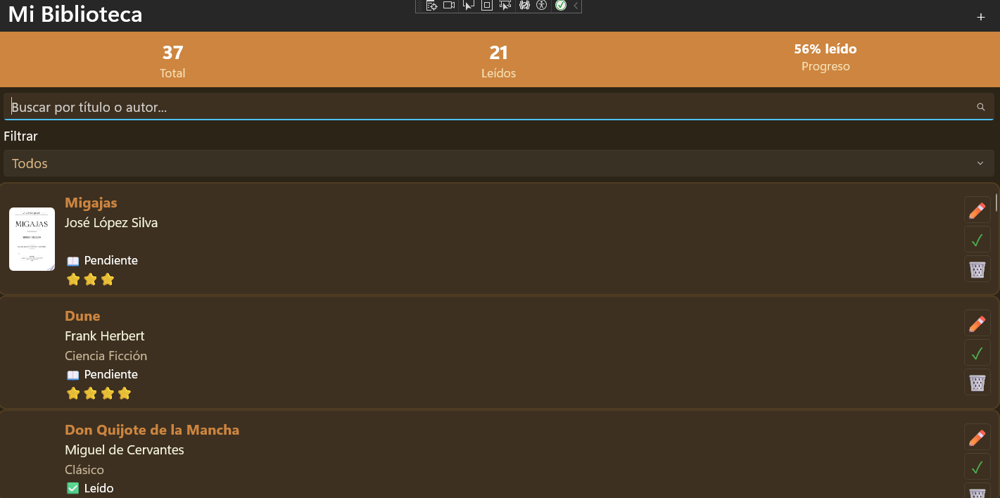
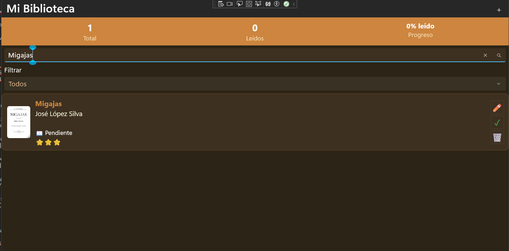
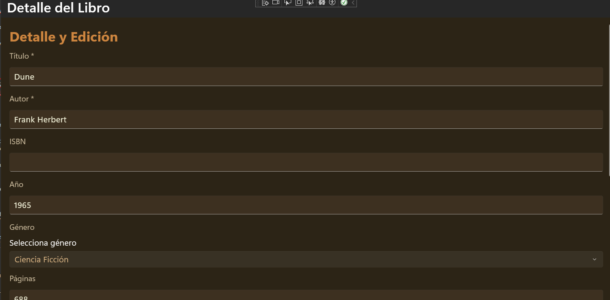
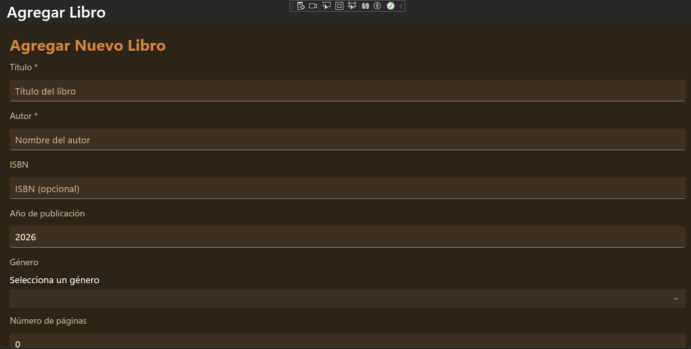
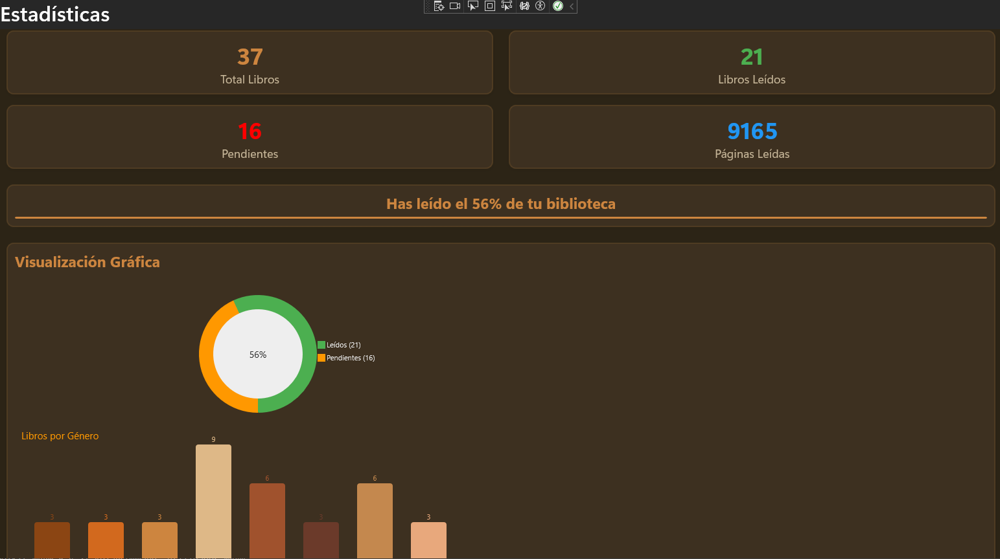

#Biblioteca Personal — Proyecto Final

**Curso:** Desarrollo Móvil Multiplataforma (.NET MAUI)  
**Período:** 4 | Semanas 13-14  
**Valor:** 25 puntos (25% nota final)  
**Plataforma:** .NET MAUI 10 / .NET 10  

---

##Descripción del Proyecto

**Biblioteca Personal** es una aplicación móvil multiplataforma desarrollada con **.NET MAUI** que permite gestionar una colección de libros de forma completa. El usuario puede agregar libros manualmente, buscarlos en la **Google Books API**, marcarlos como leídos, editarlos, eliminarlos y visualizar estadísticas gráficas de su biblioteca.

La aplicación integra las **16 competencias** evaluadas en el curso, incluyendo persistencia local con SQLite, consumo de API REST, arquitectura MVVM, navegación Shell con FlyoutMenu, estilos Light/Dark y gráficos con GraphicsView.

---

## ✅ Funcionalidades Implementadas

###— Base de Datos SQLite
- Modelo `Book` con 11 propiedades y atributos SQLite-net
- `DatabaseService` con 9 métodos async:
  - `SaveBookAsync` — Insert/Update inteligente
  - `GetBooksAsync` — Todos los libros ordenados por fecha
  - `GetBooksByGenreAsync` — Filtro por género
  - `GetReadBooksAsync` — Trae solo libros leídos
  - `GetUnreadBooksAsync` —Trae solo libros pendientes
  - `DeleteBookAsync` — Elimina un libro
  - `UpdateReadStatusAsync` — Marcar como leído/pendiente
  - `GetStatisticsAsync` — Estadísticas completas
  - `SearchLocalAsync` — Búsqueda por título o autor
- `SeedDataAsync` — Carga automática de 12 libros de prueba al primer inicio
- 
##Enlace a video de las funcionalidades
[Video](https://youtu.be/zlzaAHseZhY)

###— Consumo de API
- Integración con **Google Books API** (`googleapis.com/books/v1`)
- `SearchBooksAsync` — Búsqueda por título, autor o tema
- `GetBookDetailAsync` — Detalles completos de un libro específico
- Parseo con `System.Text.Json` nativo (sin dependencias externas)
- Agregar libro encontrado en la API directamente a la biblioteca local (SQLite)

###— Navegación Multi-página
- **5 páginas** implementadas:
  1. `LibraryPage` — Lista principal de la biblioteca
  2. `BookDetailPage` — Detalle y edición de un libro
  3. `SearchPage` — Búsqueda en Google Books API
  4. `StatisticsPage` — Estadísticas visuales con gráficos
  5. `AddBookPage` — Agregar libro manualmente
- Shell con `FlyoutMenu` (menú lateral deslizable)
- Navegación programática con `Shell.Current.GoToAsync()`
- `QueryProperty` para pasar el ID del libro a `BookDetailPage`
- Rutas registradas con `Routing.RegisterRoute`

###— Interfaz Profesional
- `LibraryPage` con `CollectionView`, `RefreshView`, `SearchBar` y filtros
- `SearchPage` funcional con resultados de la API en tiempo real
- `BookDetailPage` con todos los campos editables (Entry, Picker, CheckBox, Slider)
- `StatisticsPage` con cards de resumen y `GraphicsView` con gráficos

### Parte 5 — Estilos y Temas (3 pts)
- `ResourceDictionary` global en `App.xaml` con colores de tema biblioteca (tonos marrones/café)
- Paleta **Light** (Linen, Brown, Cornsilk) y **Dark** (Dark Brown, Peru, BurlyWood)
- `AppThemeBinding` funcional en todos los estilos para cambio automático Light/Dark
- **7 estilos globales** definidos:
  - `TitleStyle` (28pt, Bold)
  - `SubtitleStyle` (18pt, Bold, Primary)
  - `BodyStyle` (14pt)
  - `CaptionStyle` (12pt, Secondary)
  - `CardStyle` (Border con sombra y esquinas redondeadas)
  - `PrimaryButtonStyle` (fondo Primary, texto blanco)
  - `SecondaryButtonStyle` (borde Primary, transparente)
  - `StandardEntryStyle Colores según el modo de vista seleccionado( primary o secondary)`

###— MVVM Completo
- **5 ViewModels** implementados, todos heredando de `BaseViewModel`
- `INotifyPropertyChanged` centralizado en `BaseViewModel`
- `ObservableCollection<Book>` en `LibraryViewModel`
- `RelayCommand` y `RelayCommand<T>` personalizados con soporte async/await
- Propiedades calculadas: `TotalBooks`, `ReadBooks`, `ReadPercent`
- `LoadAsync` en cada ViewModel con manejo de `IsBusy`
- Inyección de dependencias (DI) via `MauiProgram.cs`

###— GraphicsView Estadísticas
- `StatisticsDrawable` implementando `IDrawable`
- **Gráfico circular (dona)** — Libros leídos vs pendientes con porcentaje
- **Gráfico de barras** — Distribución de libros por género
- **Panel de estadísticas numéricas** — Total, Leídos, Páginas totales
- Actualización dinámica al navegar a la pantalla

### Características Adicionales Requeridas
- Filtros en `LibraryPage`: Todos / Leídos / Pendientes
- `SearchBar` local que filtra por título o autor en tiempo real
- Validación de campos obligatorios (título y autor)
- `try-catch` en todas las operaciones async
- `DisplayAlertAsync` para mensajes de error y confirmación
- `ActivityIndicator` durante cargas
- `EmptyView` en todos los `CollectionView`
- Confirmación antes de eliminar libros
- `RefreshView` para recargar la lista

---

##Arquitectura del Proyecto

ProyectoFinal_Movil_BibliotecaPersonal/
├── Models/
│   ├── Book.cs                    # Modelo principal con atributos SQLite
│   ├── BookSearchResult.cs        # Resultado de búsqueda API
│   └── BookDetail.cs              # Detalle completo desde API
├── Services/
│   ├── DatabaseService.cs         # Operaciones SQLite + LibraryStats
│   └── BookApiService.cs          # Consumo Google Books API
├── ViewModels/
│   ├── BaseViewModel.cs           # INotifyPropertyChanged base
│   ├── LibraryViewModel.cs        # Lógica biblioteca principal
│   ├── BookDetailViewModel.cs     # Detalle y edición (QueryProperty)
│   ├── SearchViewModel.cs         # Búsqueda en API
│   ├── StatisticsViewModel.cs     # Estadísticas y gráficos
│   └── AddBookViewModel.cs        # Agregar libro manual
├── Views/
│   ├── LibraryPage.xaml/.cs       # Lista principal
│   ├── BookDetailPage.xaml/.cs    # Detalle y edición
│   ├── SearchPage.xaml/.cs        # Búsqueda API
│   ├── StatisticsPage.xaml/.cs    # Estadísticas visuales
│   └── AddBookPage.xaml/.cs       # Agregar libro
├── Drawables/
│   └── StatisticsDrawable.cs      # IDrawable con gráficos
├── Helpers/
│   └── RelayCommand.cs            # ICommand sync/async genérico
├── Converters/
│   ├── BoolToReadConverter.cs     # bool → "✅ Leído" / "📖 Pendiente"
│   ├── BoolToColorConverter.cs    # bool → Color verde/naranja
│   └── RatingToStarsConverter.cs  # int → "⭐⭐⭐"
├── App.xaml                       # ResourceDictionary global (estilos y temas)
├── AppShell.xaml                  # Shell con FlyoutMenu
└── MauiProgram.cs                 # DI: servicios, ViewModels y páginas

---
## 🖼️ Screenshots

### 📱 Biblioteca

### 🔍 Búsqueda

### 📖 Detalle

### ➕ Agregar libro

### 📊 Estadísticas

---

## Instrucciones de Ejecución

### Requisitos previos
- Visual Studio 2022 o Visual Studio 2026
- .NET 10 SDK instalado
- Workload **.NET MAUI** instalado
- Para Android: Android SDK API 21+ (Android 5.0 o superior)
- Para Windows: Windows 10 versión o superior

### Paquetes NuGet utilizados
sqlite-net-pcl 1.9.172+ ORM SQLite async
SQLitePCLRaw.bundle_green 2.1.x+ Provider SQLite nativo
CommunityToolkit.Mvvm 8.4.2+ RelayCommand, utilidades MVVM
CommunityToolkit.Maui 9.x+ Extensiones UI MAUI

### Pasos para ejecutar
1. Descomprime `ProyectoFinal_Movil_BibliotecaPersonal.zip`
2. Abre `ProyectoFinal_Movil_BibliotecaPersonal.sln` en Visual Studio
3. Restaura los paquetes NuGet: **clic derecho en la solución → Restore NuGet Packages**
4. Selecciona el target: `Windows Machine`, `Android Emulator` o dispositivo físico
5. Presiona **F5** o el botón para compilar y ejecutar
6. Al primer inicio, la app carga automáticamente **12 libros de prueba**

### Nota sobre la base de datos
La base de datos SQLite (`biblioteca.db3`) se crea automáticamente en:
- **Windows:** ` C:\Users\Windows\AppData\Local\User Name\com.companyname.proyectofinal_movil_bibliotecapersonal\Data\biblioteca.db3`

---

##Paleta de Colores (Tema Biblioteca)

Primary `#8B4513` Brown `#CD853F` Peru 
Secondary `#D2691E` Chocolate `#DEB887` BurlyWood
Background `#FAF0E6` Linen `#2C2416` Dark Brown 
Surface `#FFF8DC` Cornsilk `#3D3020` Dark Surface 

---

## Competencias Evaluadas (16/16)

| # | Competencia | Implementado en |
|---|---|---|
| 1 | CONFIG_ENV | MauiProgram.cs, NuGet packages |
| 2 | ARQ_APP | Estructura MVVM, DI, carpetas |
| 3 | DEV_XAML | Todas las Views (.xaml) |
| 4 | NAV_MOBILE | AppShell, GoToAsync, QueryProperty |
| 5 | UI_DESIGN | Estilos, CardStyle, Layout responsivo |
| 6 | EVENT_HANDLING | Commands, OnAppearing, RefreshView |
| 7 | MVVM_PATTERN | 5 ViewModels con BaseViewModel |
| 8 | DATA_BINDING | TwoWay, OneWay, Converters |
| 9 | COLLECTION_BINDING | ObservableCollection, CollectionView |
| 10 | API_CONSUMPTION | BookApiService, Google Books API |
| 11 | ASYNC_PROGRAMMING | async/await en todos los servicios |
| 12 | DATA_PERSISTENCE | SQLite, DatabaseService, 9 métodos |
| 13 | CRUD_OPERATIONS | Save, Get, Update, Delete completos |
| 14 | RESOURCE_MANAGEMENT | ResourceDictionary, AppThemeBinding |
| 15 | THEME_IMPLEMENTATION | Light/Dark con AppThemeBinding |
| 16 | GRAPHICS_RENDERING | StatisticsDrawable, IDrawable, gráficos |

---

##Autor

## 👨‍💻 Autor

- Nombre: **[Grupo 5]** 
**{** 
**Alex José Rodríguez Taveras {2024-0163}**  
**Lissa Marie González Feliz {2024-0112}**  
**Elvin Manuel Méndez Espinosa {2024-0104}**  
**Cristian Luna Rosario {2024-0085}**  
**Elida Asneisy Payano Rodríguez {2024-0122}**  
**}**
**Fecha de entrega: *Abril 2026*
